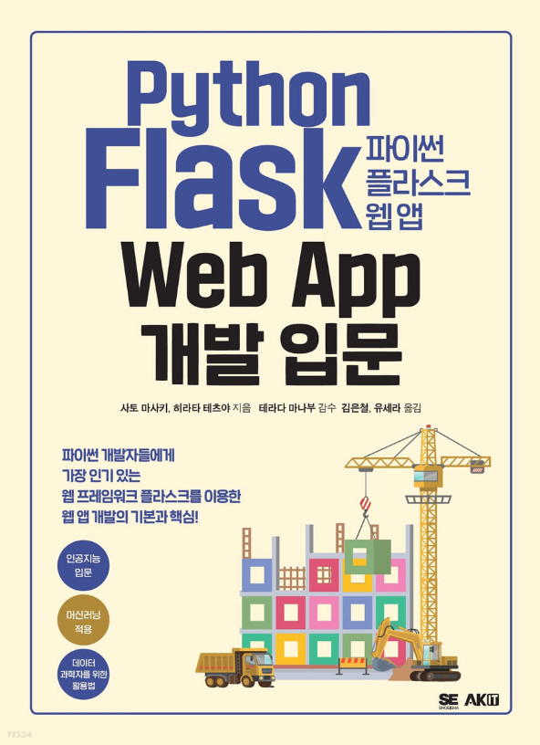

# python_flask_web_app

도서 코드 파일: http://www.amusementkorea.co.kr/bbs/board.php?bo_table=m05_01&wr_id=5

## Contensts

[Part1 Chapter1: 최소한의 기능 앱 만들기](my_code/part1/ch1/README.md)

[Part1 Chapter2: 데이터베이스를 아용한 앱 만들기](my_code/part1/ch2/README.md)

[Part1 Chapter3: 사용자 인증 기능 만들기](my_code/part1/ch3/README.md)

[Part2: 물체 감지 앱 개발하기](my_code/part2/README.md)

[Part3: 물체 감지 기능 API 만들고 배포하기](my_code/part3/README.md)
* 배포하기는 추가해야 함

[Part4: 머신러닝 API 개발하기](my_code/part4/ml_api/README.md)